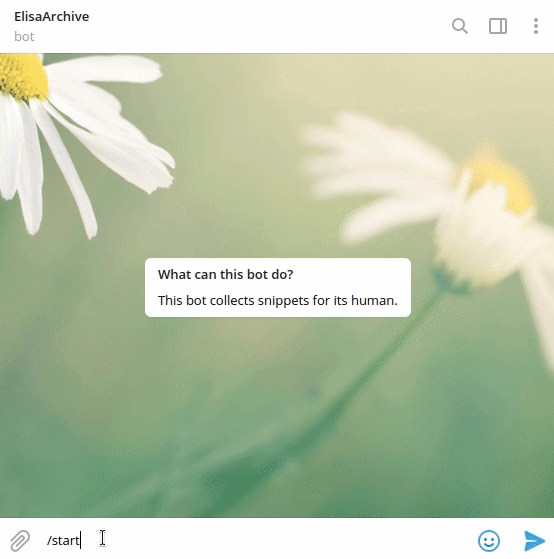

# youtube-playlist-telegram-bot
A benign telegram bot using Youtube Data API v3.

## Usage

```bash
# venv
pip3 install -r requirements.txt
./playlits-bot.py # print logging info
# or
./playlist-bot.py -log <path-of-log-dir>/test.log
```

Prerequisite: 

* [python-telegram-bot](https://github.com/python-telegram-bot/python-telegram-bot) 
* [google-api-python-client](https://github.com/googleapis/google-api-python-client) 
* argparse
* schedule

### Try My Bot

[Telegram @ElisaArchivebot](https://t.me/ElisaArchivebot) 



## Todo

- [ ] Determine the playlist list

- [x] Run as daemon 

  ```bash
  nohup ./sched.py &
  ```

- [x] why my Elisa In Ecuador account would raise exception?? -  not all users have username, use `chat.id` instead

- [x] Store the query as json files or query it everytime? - Just query it every time.

- [ ] Add soundcloud

- [ ] Do I want to wrap it up as an API?

